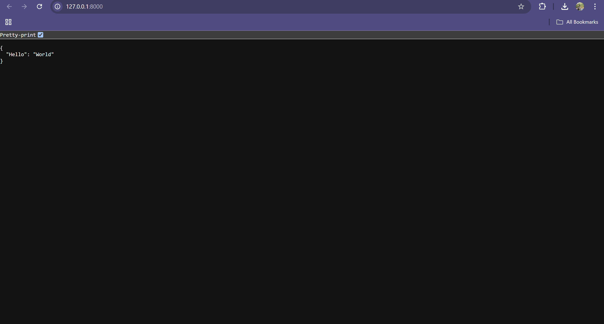

# Audition

**Audition** is a fully‑configurable, AI‑driven recruiting platform whose fundamental premise is that *every company should be able to build its own recruiter, not inherit somebody else's*.
Unlike traditional "black‑box" recruiting agents—whose prompts and scoring rubrics are hard‑wired by the vendor—Audition exposes the entire talent‑evaluation pipeline so you can design, observe, and tweak it to fit **any** role in **any** industry.

---

## Table of Contents

- [Audition](#audition)
  - [Table of Contents](#table-of-contents)
  - [Key Ideas](#key-ideas)
  - [Feature Highlights](#feature-highlights)
  - [System Architecture](#system-architecture)
  - [Getting Started](#getting-started)
    - [Option 1: Local Development Setup](#option-1-local-development-setup)
    - [Option 2: Docker Setup](#option-2-docker-setup)
  - [End-to-End Usage Walk-Through](#end-to-end-usage-walk-through)
  - [Development Journey \& Design Rationale](#development-journey--design-rationale)
  - [Tech Stack](#tech-stack)
    - [Frontend](#frontend)
    - [Backend](#backend)
  - [Visual Architecture Diagrams](#visual-architecture-diagrams)
    - [Backend Interface](#backend-interface)
    - [Frontend Interface](#frontend-interface)
    - [Detailed Sequence Flow](#detailed-sequence-flow)
    - [Use Case Overview](#use-case-overview)
    - [High-Level System Flow](#high-level-system-flow)
    - [Interview Activity Flow](#interview-activity-flow)
  - [Environment Configuration](#environment-configuration)
    - [Backend Environment Variables](#backend-environment-variables)
    - [Frontend Environment Variables (Docker)](#frontend-environment-variables-docker)
  - [Known Limitations](#known-limitations)
  - [Contributing](#contributing)
  - [License](#license)

---

## Key Ideas

| Concept                        | What It Means in Audition                                                                                                                                                                            |
| ------------------------------ | ---------------------------------------------------------------------------------------------------------------------------------------------------------------------------------------------------- |
| **"Build your own recruiter"** | You control every prompt, rubric, and decision rule instead of accepting a vendor-defined model.                                                                                                     |
| **Job-Description Engine**     | A wizard that asks targeted questions and auto‑generates four artifacts: 1) full job description, 2) curated interview questions, 3) simulation / take‑home exercises, 4) a scoring *rating rubric*. |
| **Total Transparency**         | Toggle an **admin view** (see [Usage Walk‑Through](#end-to-end-usage-walk-through)) to watch every event, agent decision, and LLM call in real time.                                                 |
| **Event-Based Agents**         | Each rubric item gets its own mini‑agent that listens to the interview timeline, forms an opinion, and proposes follow‑ups. A master agent "democratically" chooses the next question.               |
| **Industry-Agnostic**          | Works for software engineers *and* warehouse managers, baristas, VPs of Sales—anything.                                                                                                              |

---

## Feature Highlights

* **Interactive Job‑Description Wizard** – converts your answers into four production‑ready artifacts.
* **Configurable Interview Flow** – every mini‑agent is derived from your custom rubric, so the conversation tree matches *your* priorities.
* **Real‑Time Admin Dashboard** – view all events, agent prompts, model outputs, and time stamps as they happen.
* **Regenerate Artifacts at Will** – tweak a single answer and instantly refresh the JD, questions, rubric, and simulations.
* **Built‑In Timer Control** – configure time limits per interview or per question.
* **Camera & Audio Ready** – browser flow requests mic/video permissions out of the box.
* **Multi-Modal Questions** – Coding, MCQ, system design, behavioral questions supported.
* **Real-Time Evaluation** – Instant scoring, analytics, and feedback during interviews.
* **User Authentication** – Google/GitHub OAuth integration.
* **Rich Interview Reports** – Downloadable and shareable feedback with comprehensive analytics.

---

## System Architecture

```
                ┌──────────────────────────┐
                │   Interview Timeline     │  ← central event bus
                └──────────┬───────────────┘
                           │
        ┌──────────────────┼──────────────────┐
        │                  │                  │
┌──────────────┐  ┌────────────────┐  ┌────────────────┐
│ Mini-Agent #1│  │ Mini-Agent #2  │  │ Mini-Agent #N  │  ← One per rubric item
└──────┬───────┘  └──────┬─────────┘  └──────┬─────────┘
       │                 │                   │
      opinions &        opinions &          opinions &
  follow-up proposals    proposals           proposals
       │                 │                   │
       └──────────┬──────┴──────────┬────────┘
                  ▼                 ▼
              ┌────────────────────────┐
              │ Master "Chooser" Agent │  ← selects next question
              └────────────────────────┘
```

* **Event Bus**: every utterance, LLM response, or system action emits an event onto the timeline.
* **Mini‑Agents**: subscribe to the bus, update internal scores, and emit *suggested follow‑up questions* when confidence is low.
* **Master Agent**: collects suggestions and chooses the highest‑value next question via democratic pooling.
* **Stateless Front‑End**: subscribes to the same bus to render candidate view & admin dashboard in real time.

---

## Getting Started

> **Prerequisites**
>
> * Node.js 18+ & npm (front‑end)
> * Python ≥ 3.11 (back‑end)
> * MongoDB (local installation or cloud instance)
> * An OpenAI (or compatible) API key in `OPENAI_API_KEY`

### Option 1: Local Development Setup

1. **Clone the repo**

   ```bash
   git clone https://github.com/your-org/audition.git
   cd audition
   ```

2. **Backend Setup**

   ```bash
   cd backend
   
   # Create virtual environment
   python -m venv .venv
   
   # Activate (Windows):
   .venv\Scripts\activate
   # Activate (macOS/Linux):
   source .venv/bin/activate
   
   # Install dependencies
   pip install -r requirements.txt
   
   # Configure environment variables
   # Copy .env.example to .env and fill in:
   # - OPENAI_API_KEY
   # - STRIPE_API_KEY (optional)
   # - MONGO_URI (use mongodb://localhost:27017/ai_interviewer)
   # - MONGO_DB_NAME
   # - FIREBASE_ADMIN_CREDENTIALS
   
   # Start MongoDB (if local)
   mongod
   
   # Start backend
   uvicorn main:app --reload
   ```

3. **Frontend Setup**

   ```bash
   cd ../frontend
   
   # Install dependencies
   npm install
   
   # Configure environment variables
   # Copy .env.example to .env and update API endpoints if needed
   
   # Start frontend
   npm run dev
   ```

4. **Access the application**

   * Backend: [http://localhost:8000](http://localhost:8000)
   * Frontend: [http://localhost:3000](http://localhost:3000)

### Option 2: Docker Setup

1. **Clone and prepare environment**

   ```bash
   git clone https://github.com/Sidebrain/ai-interviewer.git
   cd ai-interviewer
   
   # Copy and configure environment files
   cp backend/.env.template backend/.env
   cp frontend/.env.docker.template frontend/.env.docker
   ```

2. **Run with Docker Compose**

   ```bash
   docker compose up --build
   ```

   * Frontend: [http://localhost:3000](http://localhost:3000)
   * Backend: [http://localhost:8080](http://localhost:8080)

---

## End-to-End Usage Walk-Through

1. **Navigate to *Home*** (`http://localhost:3000`).
2. Click **Create Job** → complete the *Job‑Description Engine* questionnaire.
3. On submission you receive **four artifacts**:

   * Job Description
   * Interview Questions
   * Simulation / Take‑Home Tasks
   * Rating Rubric
     You can **Regenerate** any artifact from this screen.
4. There is an **Interview Link** generated. Copy the URL.
5. **Open the Link** in a new tab (this is the *candidate view*).

   * Grant microphone / camera permissions when prompted.
   * after going through all the steps, the interviewer takes 1-2 minutes to confugure itself. It is done configuring when the AI asks you the first question.
6. **Toggle Admin View**:

   * Append `/admin` (or the route you find in `client/src/router.ts`) to the interview URL.
   * After the interview is loaded, change the route from `/interview?interview_session_id=ba914e9c-da02-49f4-87d3-311ec28a0752` to `/simulate-interview?interview_session_id=ba914e9c-da02-49f4-87d3-311ec28a0752`
    * This is the under the hood view and shows the Evaluation agents, and shows the sample answer that gets generated (you can also switch on perspectives by going to backend/app/event_agents/itnerview/factory.py and setting the flag to true)
7. **Adjust Timers** if desired (same factory as above).
8. Conduct the interview; watch the conversation tree evolve in real time.
9. Review final rubric scores and exported transcript.

---

## Development Journey & Design Rationale

| Version                               | What We Tried                           | Why We Moved On                                                            |
| ------------------------------------- | --------------------------------------- | -------------------------------------------------------------------------- |
| **v0 – Simple Agent**                 | Single LLM prompt; no branching.        | Zero flexibility, hard‑coded flow.                                         |
| **v1 – LangGraph Prototype**          | Adopted LangGraph for node‑edge graphs. | Extra framework abstraction limited low‑level control.                     |
| **v2 – Hand‑Rolled Graph**            | Custom Python graph engine.             | Graphs still too rigid; adding/removing nodes painful.                     |
| **v3 – Event‑Based System (Current)** | Central timeline + subscriber agents.   | Maximum configurability, mirrors real‑world "events happen, agents react." |

**Why Events?**

* Mirrors conversational reality.
* Lets mini‑agents act independently yet remain synchronized.
* Unlocks features like real‑time dashboards and replay.

**Trade‑Offs**

* **Traceability** – when *everything* is an event, pinpointing a failure path is harder.
* **Observability** – we solved this with the admin dashboard, but deeper tracing tools are on the roadmap.

---

## Tech Stack

### Frontend

- **Next.js** (React, TypeScript, SSR)
- **Tailwind CSS** (utility-first styling)
- **Radix UI** (accessible component primitives)
- **Firebase Auth** (Google/GitHub OAuth)
- **WebSocket** (real-time backend communication)

### Backend

- **FastAPI** (Python, async-first web framework)
- **MongoDB** (document database with Beanie ODM)
- **OpenAI API** (GPT models for dynamic questioning and evaluation)
- **Firebase Admin SDK** (authentication and user management)
- **WebSocket Streaming** (real-time interview communication)
- **Dockerized** (containerized deployment)

---

## Visual Architecture Diagrams

### Backend Interface
<div align="center">
  
</div>

### Frontend Interface
<div align="center">
  
</div>

### Detailed Sequence Flow
<div align="center">
  
</div>

### Use Case Overview
<div align="center">
  
</div>

### High-Level System Flow
<div align="center">
  
</div>

### Interview Activity Flow
<div align="center">
  
</div>

---

## Environment Configuration

### Backend Environment Variables

```bash
OPENAI_API_KEY=sk-...
STRIPE_API_KEY=sk-...  # Optional
CLIENT_URL=http://localhost:3000
MONGO_URI=mongodb://localhost:27017
MONGO_DB_NAME=ai_interviewer
FIREBASE_ADMIN_CREDENTIALS=./secrets/firebase-admin-key.json
```

### Frontend Environment Variables (Docker)

```bash
NEXT_PUBLIC_WS_URL=ws://localhost:8000/api/v1/websocket/ws
NEXT_PUBLIC_WS_URL_V2=ws://localhost:8000/api/v2/websocket/ws
NEXT_PUBLIC_WS_URL_V3=ws://localhost:8000/api/v3/websocket/ws
NEXT_PUBLIC_CLIENT_LOG_LEVEL=info
BACKEND_URL=http://localhost:8000
```

---

## Known Limitations

* **Debugging Complexity** – event storms can hide the root cause of a failed LLM call.
* **Localhost‑Only Quick‑Start** – no one‑click cloud deployment script (yet).
* **Admin Route Discoverability** – currently requires manual URL edit; a UI toggle is planned.
* **MongoDB Dependency** – requires local MongoDB installation or cloud instance setup.

---

## Contributing

1. Fork → create feature branch → open pull request.
2. For major changes, open an issue first to discuss scope.
3. Follow the existing event schema; new event types belong in `/server/app/events/`.

---

## License

Distributed under the MIT License. See `LICENSE` for details.

---

*"The world is auditioning for a role. Give it a fair script."*

