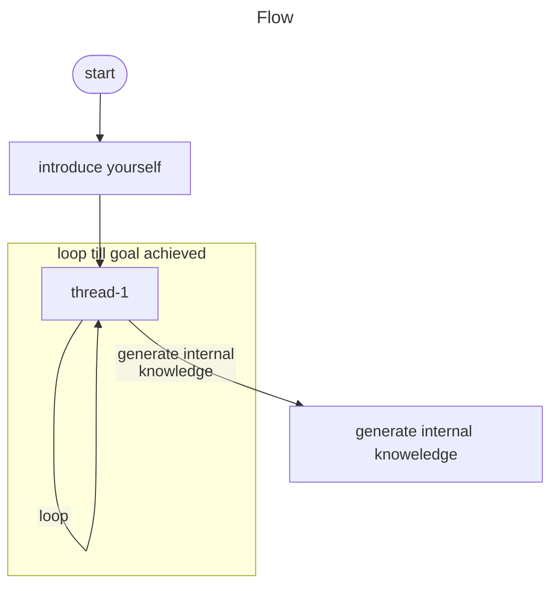
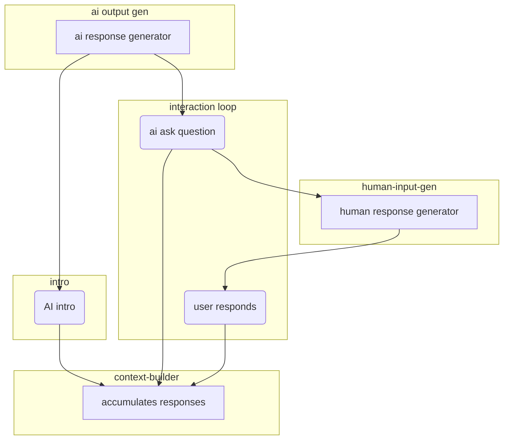

# Architecture v2

Conversational experiences

At the root are `threads`

Each thread is a purpose driven interaction.



```python

class Thread(BaseModel): 
    goal = "gather minimum requirements to conduct an interview"
    ideal_state = """The interview is for the following:
        - role: Senior consultant
        - company: Bain Consulting
        - 
"""
    current_state: str

    def check_if_ideal_state_has_been_achieved():
        ...

```

Questions for hiring manager:
- designation and role
- why the requirement
- deep dive into requirement (required)
  - expereince
  - leading a team
  - junior / senior
  - roadmap for their career
- roi of the role 
- salary / budget 
- backup - if the role does not work (overhire) how we can push to a different role (get somebody with two skillsets)
- culture --> style of work 

# Sid 
Personal - attitude
technical 
scenario based questions - sales questions (appvle vs..)
senioir manager - scenario based, berhavioral 
hr - acceptance 

Insights from Masai:
- pardon please, askign the ai to repeat themselves
- clarifications on the question (can you tell me how i can share my screen)
- reference to the speaker as AI, as in "hi AI"

