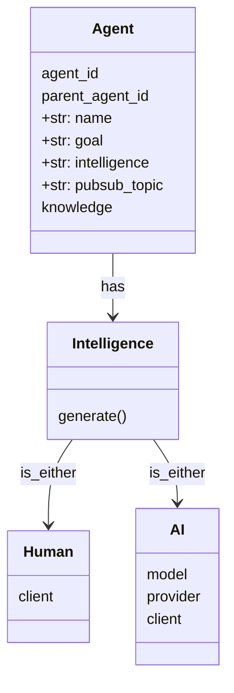

## What we are building:
A self configuring controllable architecture for agent creation and agent communication. Think of it like an OS for an agent universe. It is inspired by the society of minds book by Marvin Minsky and by the spirituality present in hinduism and western philosophy. 

## Thoughts about the architecture

- the `gamemaster` is the God equivalent of the universe we are building. 

gamemaster's responsibilities:
- configure sub agents 
- birth - preservation - kill of agents
- Connecting intelligences to the agents 
- configuring the agents
- gathering knowledge to determine it's goal
- distributing tools

Is a gamemeaster an agent, can we recurse down?

Gamemaster is an agent with added responsibilities? Is that true? The only thing it posseses is knowledge of the goal, that is what it is passing down. 

If a gamemmaster has the ability to create agents, to what end? Why should it have recursive agent creation abilities? What complexities does it enable?

Goal: 
Learning --> I want to learn the intricacies of how websockets work.
Interview --> Check if this person understands the intricacies of how websockets work

Gamemaster:
I understand my goal. 

What do i need to achieve my goal? 
- I need to construct a reward agent 
- I need to construct an interviewer agent
- I need to create an internal reward mechanism ()()

This agent will be the decider of the action. 

You also need a creator agent. This agent will be responsible for coming up with new ideas. 

We need abilty to determine that reward has been achieved. 

Can each question be its own agent? 
Generating information for the other agents to consume asynchronously? Preparing questions in advance. Every action ripple effects, by causing other agents to update their world view. 
This will likely be the condition for handing over control to the gamemanager, who then decides the next agent who gets to engage. 
Does this kill the prev question-agent? It doesnt need to, but there is also no value to keeping it alive. In fact it will also update it's world view so it is going to consume LLM resources. 

Let's think about question-agents, why do they get to have their own existence. I guess they are the quivalent of a thread, a conversational thread. So does that mean when you are talking to somebody you have multiple conversational threads or just one? I guess the principal of recursion applies here too. Each conversation is built up of smaller conversational threads. So that maps decently well. 

I like that so much of my architecture is finding it's way to recursion. I think it's good right? Does recursion offer benefits? Hmm you can take advantage of memoization to reduce the crazy number of calls but is it inherently parallelizable? Recursion is a high branching strategy, a high branching strategy is inherenly paraellizable i think. The one hijink is that state may need to be shared and I dont know if that is complex. 

Actually it turns out that recursion is actually not a good fit for parallelization. 

Each agent is responsible for:
- generating an output based on the memory it has access to 
    - creating -- rewarding -- deciding 
- introspecting (turb by turn)
- reflection (end of thread, right before death)
- when it receives a goal from the higher, it takes that and augment/transforms it based on it's own context

How do agents communicate in this world?
- sibling agents can communicate
- parent and child can communicate 
- can one parent communicate with another child? 
    - Is it needed? 
    - What benefit would this provide?

When two agents communicate it is an event, an event is a splash in the universe because something happened. In our world this means that the memory of all the agents sharing the same parent will get updated. 

Event is a new concept, let's think about it:

What is an event
An event is the turning of probabilities into reality. Reality can only happen in the universe not within you. 
So when two agents interact, they need to produce something. 
What is the event payload?

Who decides two agents can communicate?
I mean if you are in the same universe, then you do have access to the other. 
But in certain environments we want to enforce strict seaparation. But do we?
I thought that the memory of all the siblings gets updated, that means they already are communicating. 
However in an interview, they cannot. So here strict separation is enforced. 

Is a memory update an event? Yes it is.
Is that the only type of event, from a spiritual perspective all we have is the eternal now. The past is a filtered intake of the reality. 
Should every agent, contextualize the event it gets. Yes, no? Truly spiritually awoken agents are such that have managed to remove the contextualization filter. So gamemanager is the only one to have no contextualization filter. Does that make sense? 

Teh destroy capability of an agent is something to be looked into. The parent is the authority system for their children. Everythong passes through them. They are what updates the memory of all the siblings. At this stage it can perform checks and decides if any agent is going out of line and destroy it and respawn it. 

How is state preserved? If the gamemaster is randomly creating agents with specific roles, then they arent learning. 

# Synthesis of thooughts

basic data structures needed:
- Agent
- 

